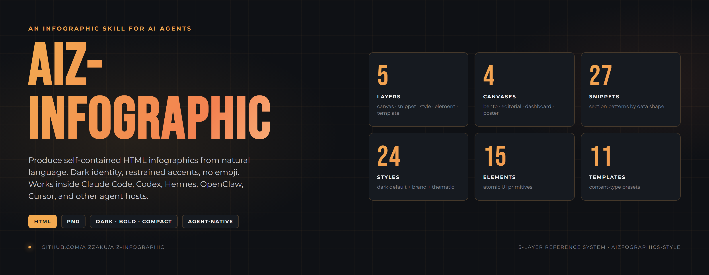
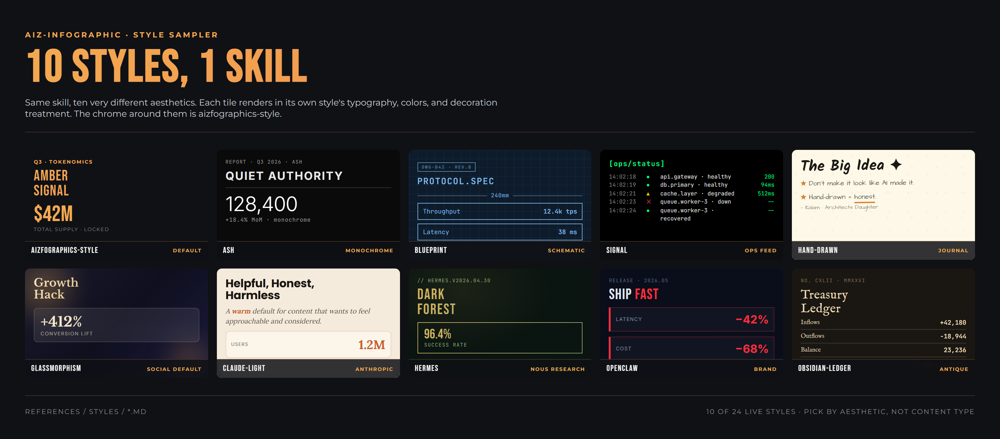
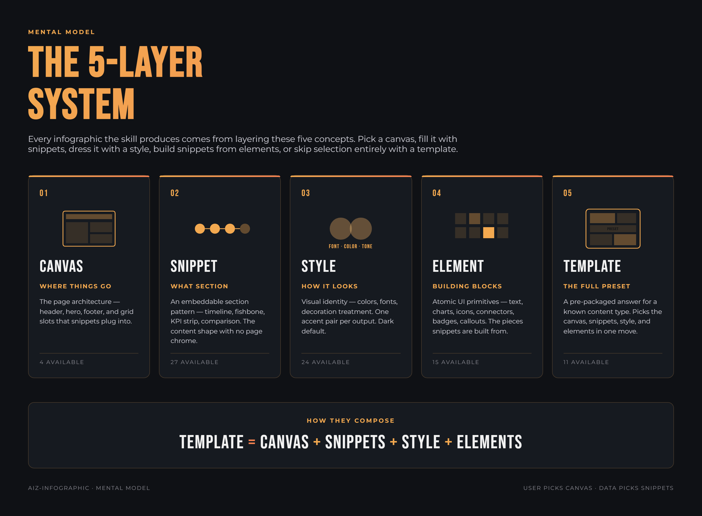
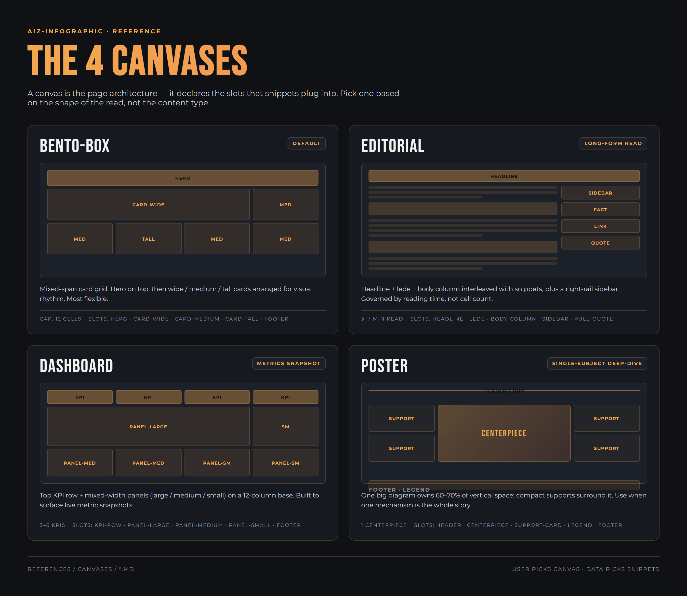
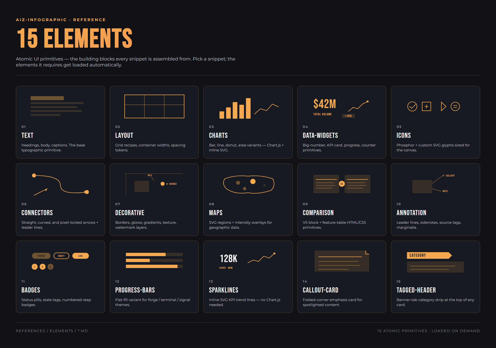
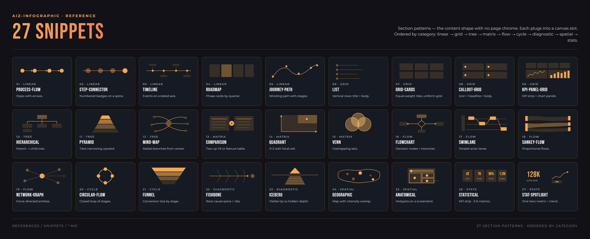

# aiz-infographic

An infographic skill for AI agents — works inside Claude Code, Codex, Hermes, OpenClaw, Cursor, and any agent host that loads skills. Turns data and text into polished, self-contained HTML infographics with reliable PNG export.

<br>

<p align="center">
  
</p>

<br>

<p align="center">
  
</p>

<br>

---

## Install

### Full install (skill + PNG export)

```bash
curl -fsSL https://raw.githubusercontent.com/aizzaku/aiz-infographic/main/install.sh | bash
```

Requires Node.js and Python 3.9+ on your PATH. Installs the skill, Playwright, and Chromium for PNG export.

### Skill only

```bash
npx skills add https://github.com/aizzaku/aiz-infographic
```

### PNG export only (if you skipped it above)

```bash
pip install "playwright>=1.40.0" && playwright install chromium
```

---

## What you get

Paste in your data or describe what you want. The skill designs, codes, and exports a production-quality infographic in one conversation.

- **HTML output** — fully self-contained, opens in any browser
- **PNG export** — 2x DPR via Playwright, ready to share or publish
- **In-browser editing** — click any text to edit it, adjust accent colors, undo/redo — no code required
- **Signal sheet** — optional companion that surfaces derived insights and second-order implications from the same data
- **Social copy** — optional X/LinkedIn/Instagram post copy generated alongside the visual
- **Agent-portable** — runs inside Claude Code, Codex, Hermes, OpenClaw, Cursor, and other agent hosts

---

## How it works

The skill uses a 5-layer reference system to compose infographics. You never need to understand this to use it — but here's the model.

<p align="center">
  
</p>

| Layer | Role | Count |
|---|---|---|
| **Canvas** | Where things go — page architecture | 4 |
| **Snippet** | What section — embeddable content pattern | 27 |
| **Style** | How it looks — visual identity | 24 |
| **Element** | Building blocks — atomic UI primitives | 15 |
| **Template** | The full preset — content-type bundle | 11 |

**TEMPLATE = CANVAS + SNIPPETS + STYLE + ELEMENTS**

---

## Canvases

A canvas is the page architecture. It declares the slots that snippets plug into. Pick one based on the shape of the read, not the content type.

<p align="center">
  
</p>

- **bento-box** — default. Mixed-span card grid for most content.
- **editorial** — long-form read with body column + sidebar.
- **dashboard** — KPI row + mixed-width panels for metric snapshots.
- **poster** — one big diagram with compact supports around it.

---

## Elements

Atomic UI primitives — the building blocks every snippet is assembled from. Pick a snippet; the elements it needs get loaded automatically.

<p align="center">
  
</p>

15 elements cover text, layout, charts, icons, connectors, badges, sparklines, callouts, and more. You compose snippets out of these; you rarely touch them directly.

---

## Snippets

Section patterns — the content shape with no page chrome. Ordered by category: linear → grid → tree → matrix → flow → cycle → diagnostic → spatial → stats.

<p align="center">
  
</p>

27 snippets, each with declared slot fit and density cap. The data shape picks the snippets; you pick the canvas. Templates pick both for known content types.

---

## Styles

24 visual identities, from dark editorial to brand-specific to playful. Pick by aesthetic — every style works across every canvas and snippet.

<p align="center">
  
</p>

**Default:** `aizfographics-style` — dark, Bebas Neue + Montserrat, amber accent pair.

**Brand styles** (`openclaw`, `hermes`, `openai-dark`, `grok-dark`, `vercel-dark`, `claude-light`) activate automatically when the subject matches the brand. **Themed styles** (`forge`, `terminal`, `signal`, `cyberpunk`, `retro`, `glassmorphism`, `obsidian-ledger`, and more) match the vibe of the content.

---

## Usage

Once installed, trigger it in your agent host (Claude Code, Codex, Hermes, OpenClaw, Cursor, etc.) with any natural language request:

```
state of AI agents infographic
how does CRISPR work — turn it into a visual
ecosystem overview for the longevity science space
AI funding landscape 2025 cheatsheet
comparison of humanoid robots — blueprint style
case study infographic: how Notion grew to 30M users
```

### One-shot vs guided

The skill auto-detects which mode fits:

- **One-shot** — if you provide the data and the type is clear, it generates immediately
- **Guided** — if the request is open-ended, it walks you through canvas, sections, style, and color with tappable menus

Force one-shot: `just make it`, `here's everything`, `quick`
Force guided: `help me choose`, `walk me through`, `what layout`

### Finishing and exporting

When you're happy with the result, say `done`, `export`, `looks good`, or `ship it`. The skill runs the PNG export automatically.

---

## Templates

| Template | What it's for |
|---|---|
| `ecosystem-overview` | Landscape maps — players, categories, relationships |
| `cheatsheet` | Dense reference grids — commands, shortcuts, comparisons |
| `how-it-works` | Step-by-step process explainers |
| `concept-explainer` | Abstract ideas made visual — frameworks, mental models |
| `case-study` | Growth stories with outcome + mechanism + how-to-apply steps |
| `report` | Data-heavy multi-section briefings with KPIs |
| `allocation-breakdown` | Supply splits, budget breakdowns, vesting schedules |
| `distribution-guide` | Eligibility, tiers, claim steps |
| `game-overview` | Game mechanics, economy, faction comparisons |
| `game-mechanics` | Loop diagrams, reward structures, progression trees |
| `collection-showcase` | Item galleries with rarity and trait breakdowns |

Unmapped content types still work — the skill picks the best canvas and section patterns for what you provide.

---

## Output structure

```
output/
├── <name>.html             # canonical source — edit this
├── <name>.png              # 2x DPR PNG via Playwright
├── <name>-signals.html     # optional: derived insight sheet
├── <name>-signals.png
└── <name>-posts.md         # optional: X/LinkedIn/Instagram copy
```

The HTML is always the canonical file. The PNG is a snapshot of it. The signal sheet is a separate infographic surfacing math, comparisons, and second-order consequences the main visual doesn't show.

---

## Credits

- Install pattern modeled after [baoyu-skills](https://github.com/jimliu/baoyu-skills) by Jim Liu
- Distributed via [skills.sh](https://skills.sh)

---

NOTE: If you liked this skill and it helped, I would appreciate a star on aiz-infographic Github. Thank you.
