# aiz-infographic

A Claude Code skill that turns data and text into polished, self-contained HTML infographics — with reliable PNG export.

<br>

<p align="center">
  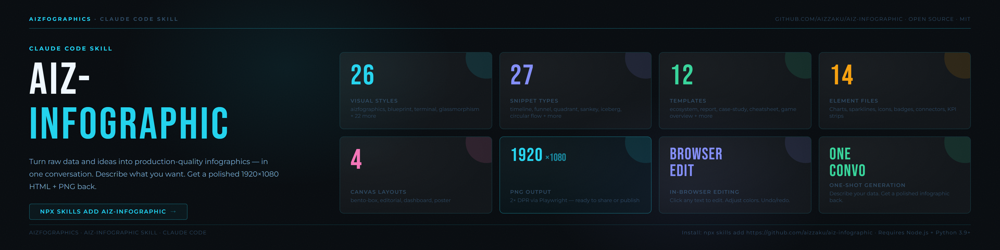
</p>

<br>

---

## Examples

<p align="center">
  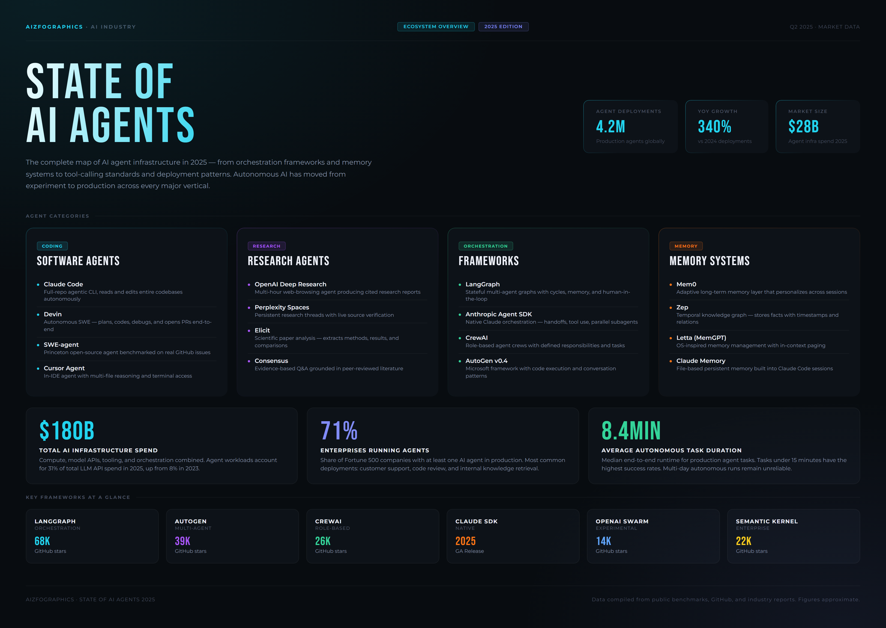
  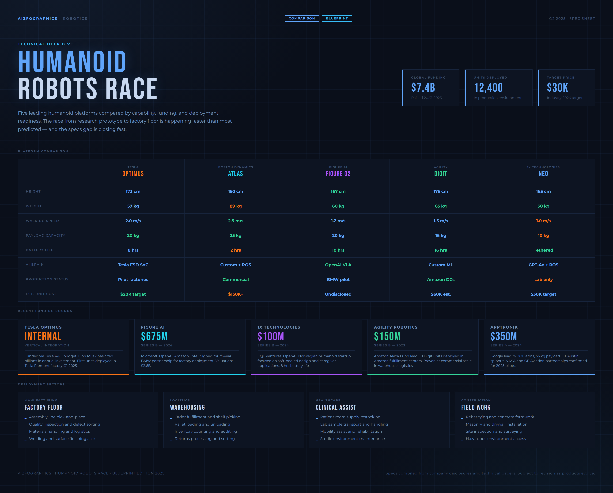
</p>

<p align="center">
  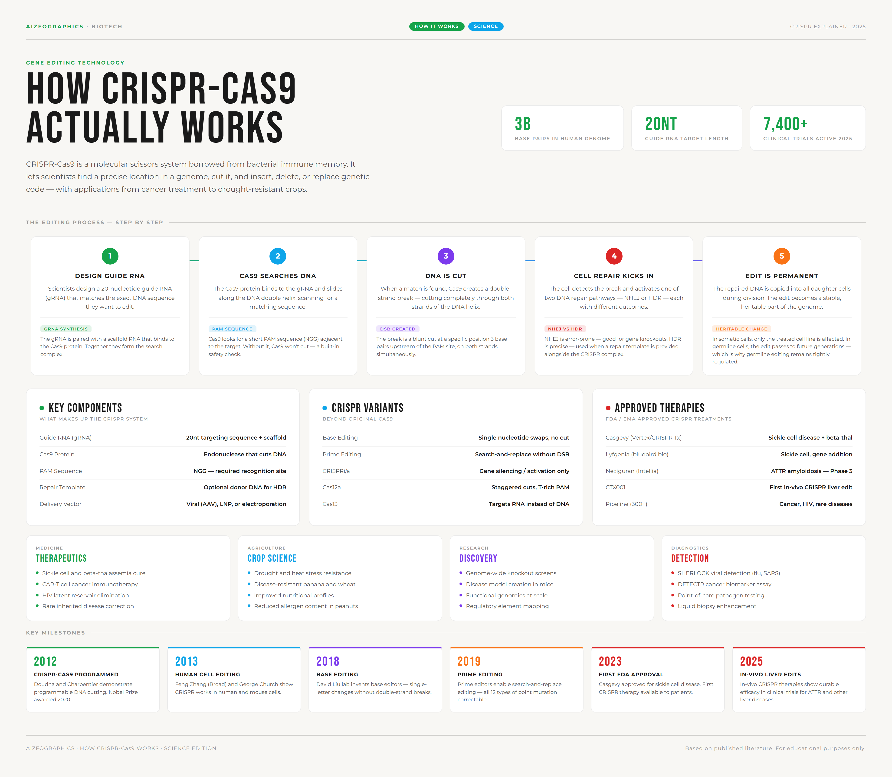
  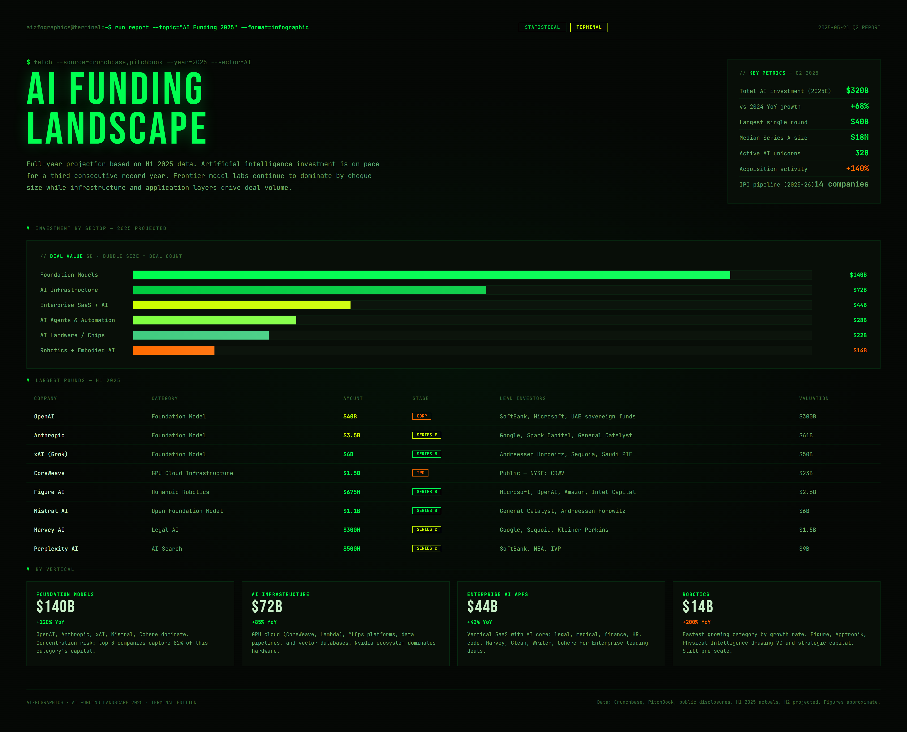
</p>

<p align="center">
  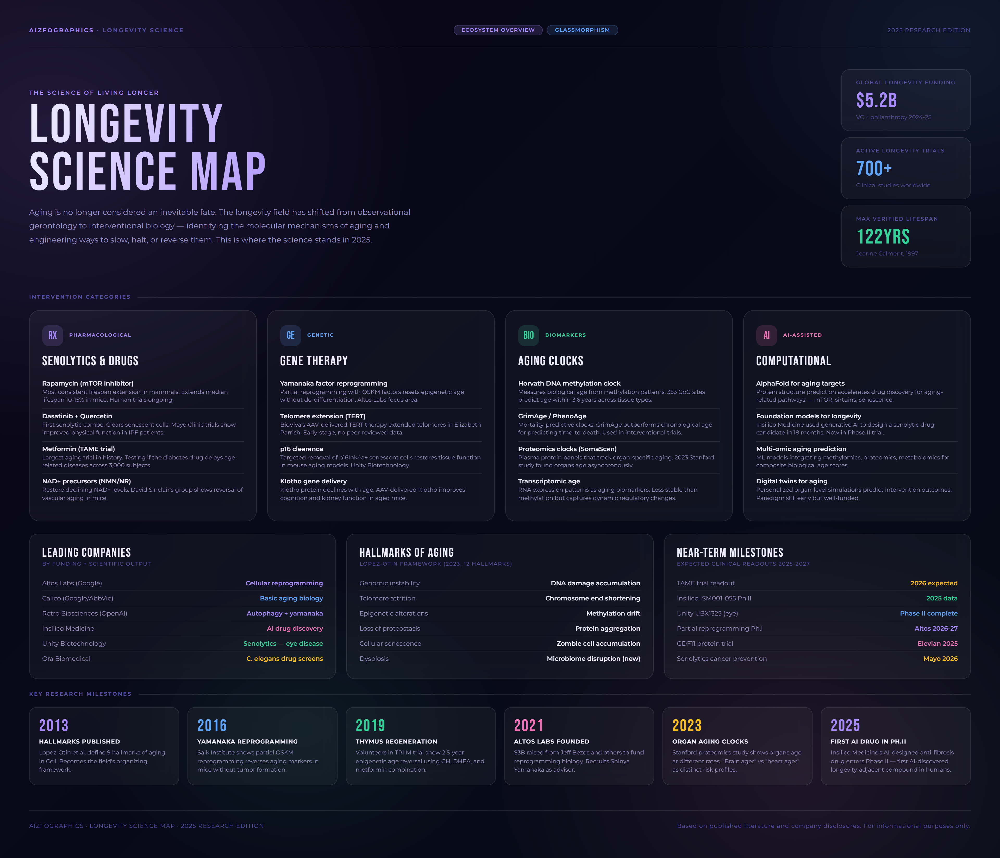
  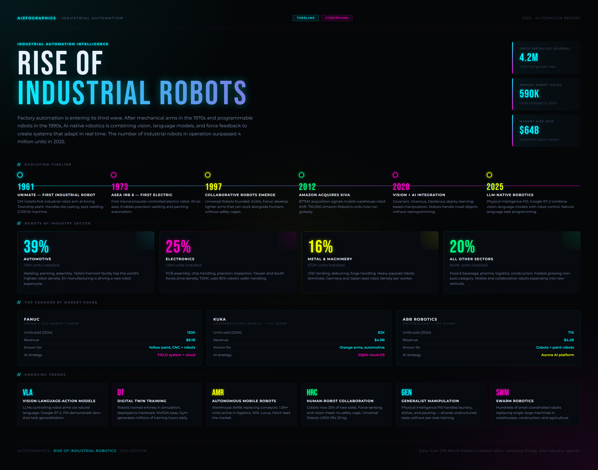
</p>

<p align="center">
  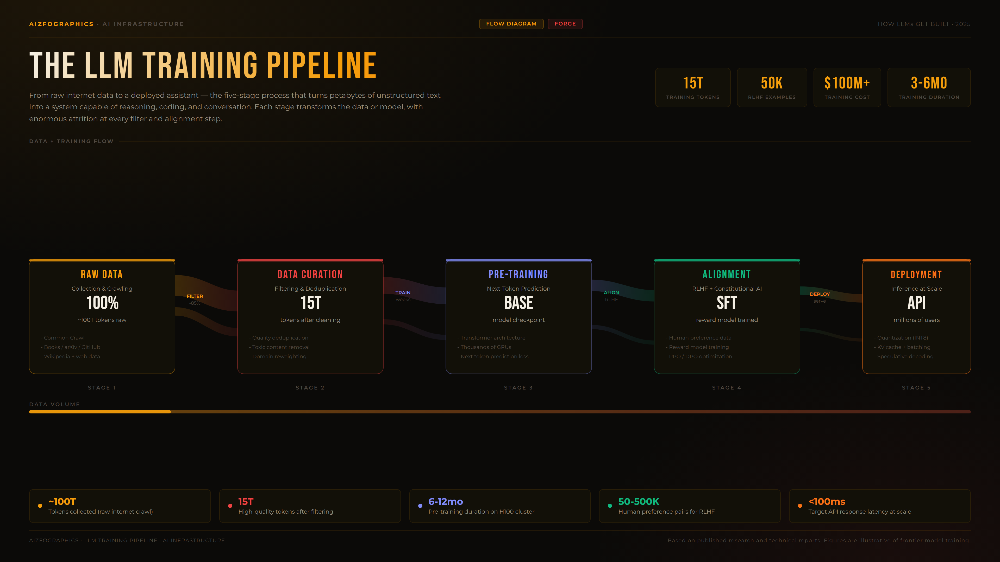
  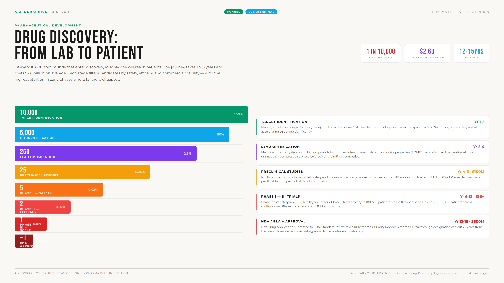
</p>

<p align="center">
  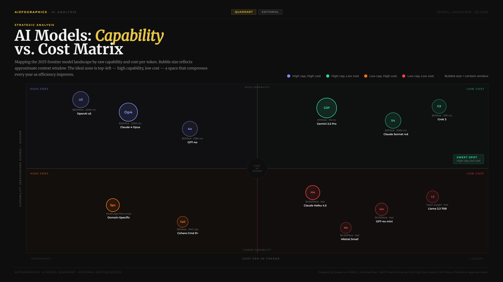
  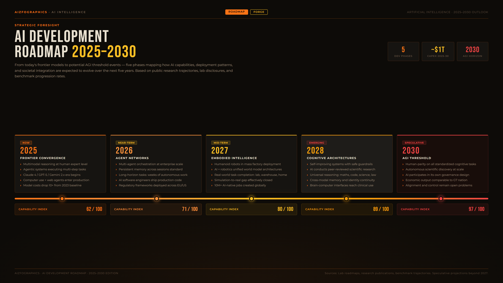
</p>

<p align="center">
  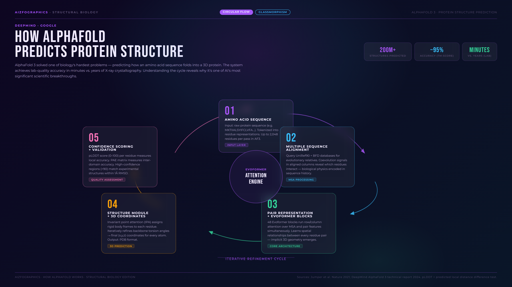
  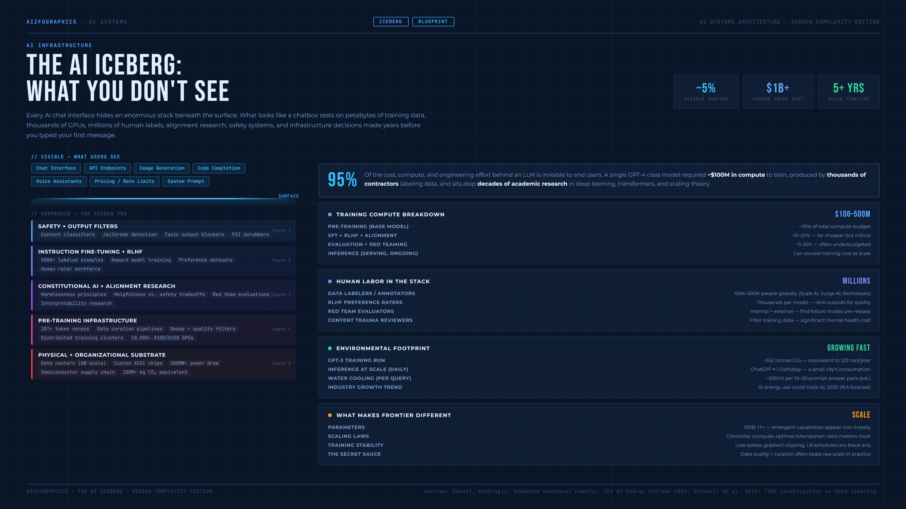
</p>

<br>

---

## What you get

Paste in your data or describe what you want. The skill designs, codes, and exports a production-quality infographic in one conversation.

- **HTML output** — fully self-contained, opens in any browser
- **PNG export** — 2x DPR via Playwright, ready to share or publish
- **In-browser editing** — click any text to edit it, adjust accent colors, undo/redo — no code required
- **Signal sheet** — optional companion that surfaces derived insights and second-order implications from the same data
- **Social copy** — optional X/LinkedIn/Instagram post copy generated alongside the visual
- **Figma round-trip** — run the HTML through [html.to.design](https://www.figma.com/community/plugin/842128343887514257) for a fully editable vector file

---

## Install

### Full install (skill + PNG export)

```bash
curl -fsSL https://raw.githubusercontent.com/aizzaku/aiz-infographic/main/install.sh | bash
```

Requires Node.js and Python 3.9+ on your PATH. Installs the skill, Playwright, and Chromium for PNG export.

### Skill only

```bash
npx skills add https://github.com/aizzaku/aiz-infographic
```

### PNG export only (if you skipped it above)

```bash
pip install "playwright>=1.40.0" && playwright install chromium
```

---

## Usage

Once installed, trigger it in Claude Code with any natural language request:

```
state of AI agents infographic
how does CRISPR work — turn it into a visual
ecosystem overview for the longevity science space
AI funding landscape 2025 cheatsheet
comparison of humanoid robots — blueprint style
case study infographic: how Notion grew to 30M users
```

### One-shot vs guided

The skill auto-detects which mode fits:

- **One-shot** — if you provide the data and the type is clear, it generates immediately
- **Guided** — if the request is open-ended, it walks you through canvas, sections, style, and color with tappable menus

Force one-shot: `just make it`, `here's everything`, `quick`  
Force guided: `help me choose`, `walk me through`, `what layout`

### Finishing and exporting

When you're happy with the result, say `done`, `export`, `looks good`, or `ship it`. The skill runs the PNG export automatically.

---

## Templates

| Template | What it's for |
|---|---|
| `ecosystem-overview` | Landscape maps — players, categories, relationships |
| `cheatsheet` | Dense reference grids — commands, shortcuts, comparisons |
| `how-it-works` | Step-by-step process explainers |
| `concept-explainer` | Abstract ideas made visual — frameworks, mental models |
| `case-study` | Growth stories with outcome + mechanism + how-to-apply steps |
| `report` | Data-heavy multi-section briefings with KPIs |
| `allocation-breakdown` | Supply splits, budget breakdowns, vesting schedules |
| `distribution-guide` | Eligibility, tiers, claim steps |
| `game-overview` | Game mechanics, economy, faction comparisons |
| `game-mechanics` | Loop diagrams, reward structures, progression trees |
| `collection-showcase` | Item galleries with rarity and trait breakdowns |
| `compact-growth-hacking` | Compact single-page growth playbooks |

Unmapped content types still work — the skill picks the best canvas and section patterns for what you provide.

---

## Styles

26 visual identities built in. Each example above uses a different style to show the range.

| Style | Look | Used in example above |
|---|---|---|
| `aizfographics-style` | Dark, bold, gradient glow. The default. | AI Agents · LLM Pipeline |
| `blueprint` | Engineering schematic, grid lines, technical | Humanoid Robots · AI Iceberg |
| `clean-minimal` | Light background, generous whitespace | CRISPR explainer · Drug Discovery |
| `terminal` | Monospace, green-on-black, scanlines | AI Funding |
| `glassmorphism` | Frosted glass panels on dark gradient | Longevity Science · AlphaFold |
| `cyberpunk` | Neon cyan + pink on deep black | Industrial Robotics |
| `editorial` | Magazine layout, large type, long-form | AI Model Quadrant |
| `forge` | Dark metallic, industrial orange/amber | AI Roadmap 2030 |
| `scrapbook` | Physical evidence aesthetic, warm tones | — |
| `ash` | Monochrome editorial, clean | — |
| `obsidian-ledger` | Antique accounting, serif | — |
| `openclaw` | Blue-black, hot-red — OpenClaw brand | — |
| `claude-light` | Warm cream + terracotta — Anthropic brand | — |
| `grok-dark` | True black, weight-900 ALL CAPS — xAI brand | — |

Brand styles (`openclaw`, `hermes`, `openai-dark`, `grok-dark`, `vercel-dark`, `claude-light`) activate automatically when the infographic subject matches the brand.

---

## How it works

The skill uses a 5-layer reference system to compose infographics. You never need to understand this to use it.

| Layer | Role |
|---|---|
| **Canvas** | Page architecture — header, hero, footer, grid slots. Options: `bento-box`, `editorial`, `dashboard`, `poster` |
| **Snippet** | Section pattern plugged into a canvas slot — timeline, process-flow, comparison, network-graph, sankey, funnel, quadrant, roadmap, circular-flow, iceberg, and 17 more |
| **Style** | Visual identity — colors, fonts, spacing tokens. 26 available |
| **Element** | Atomic UI primitives — charts, icons, connectors, badges, sparklines. 14 element files |
| **Template** | Preset combining canvas + style + snippet picks for a content type. 12 templates |

---

## Output structure

```
output/
├── <name>.html             # canonical source — edit this
├── <name>.png              # 2x DPR PNG via Playwright
├── <name>-signals.html     # optional: derived insight sheet
├── <name>-signals.png
└── <name>-posts.md         # optional: X/LinkedIn/Instagram copy
```

The HTML is always the canonical file. The PNG is a snapshot of it. The signal sheet is a separate infographic surfacing math, comparisons, and second-order consequences the main visual doesn't show.

---

## Credits

- Install pattern modeled after [baoyu-skills](https://github.com/jimliu/baoyu-skills) by Jim Liu
- Distributed via [skills.sh](https://skills.sh)

---

TIP: Use the html.to.design Figma plugin to get a fully editable infographic in Figma.

NOTE: If you liked this skill and it helped, I would appreciate a star on aiz-infographic Github. Thank you.
